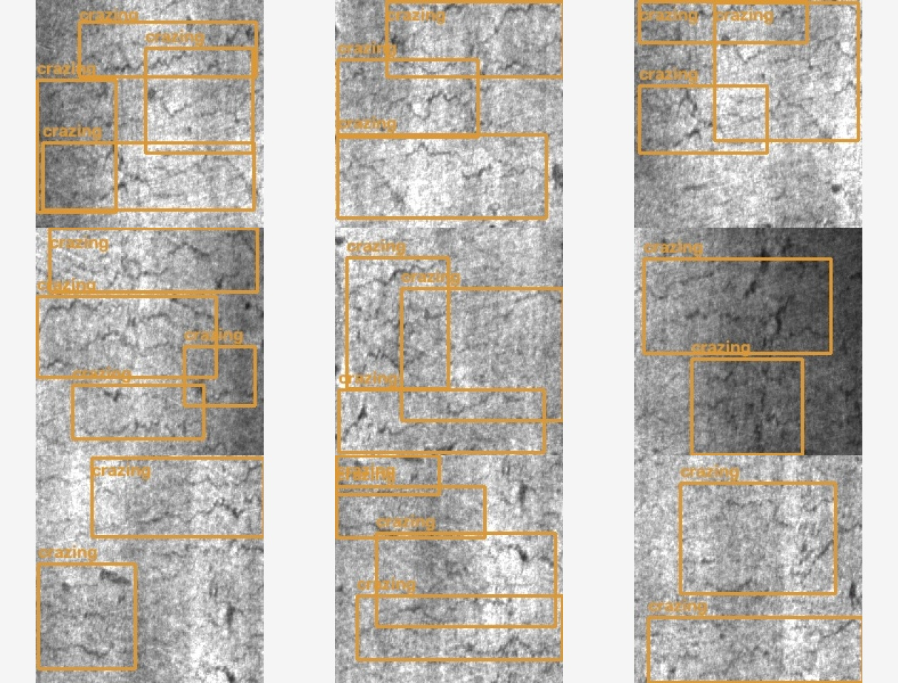
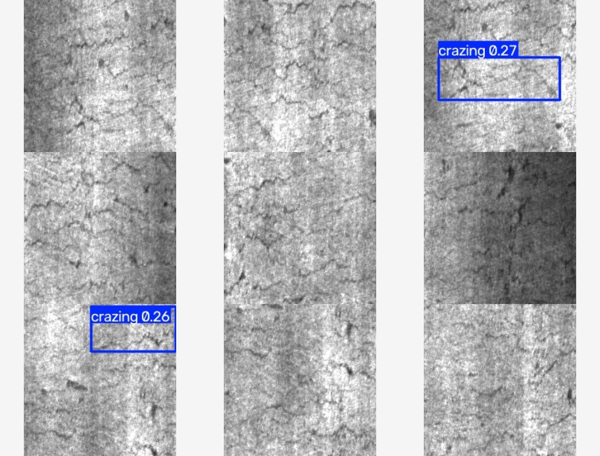
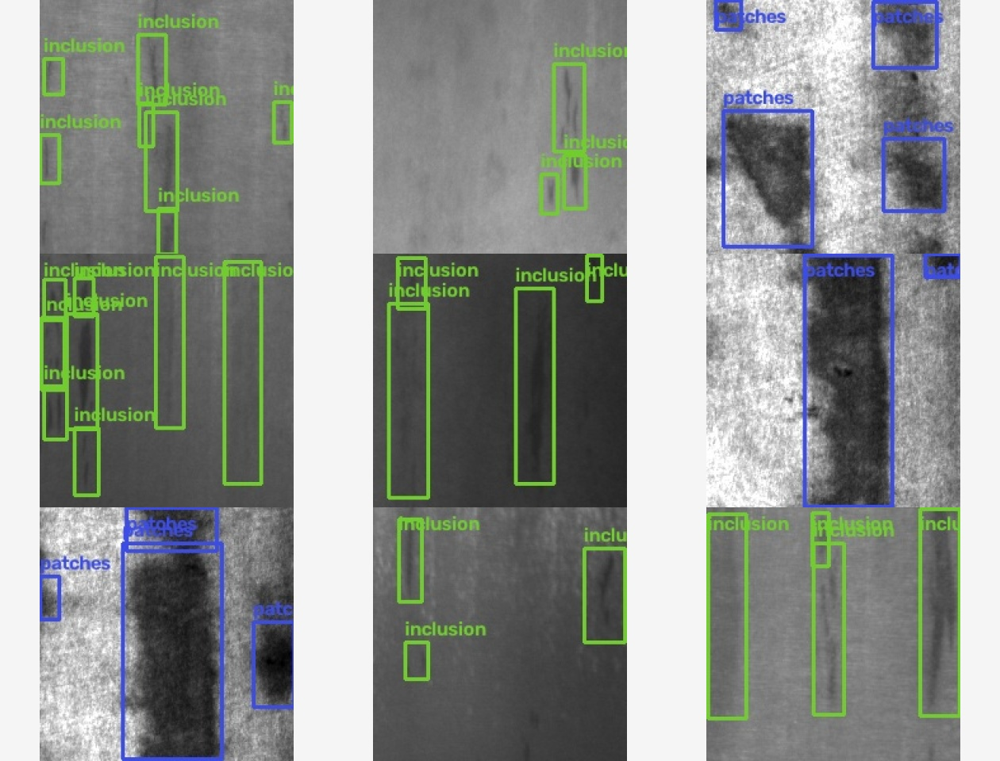
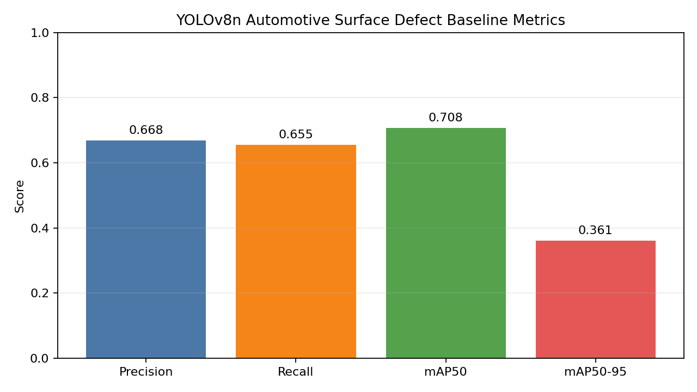
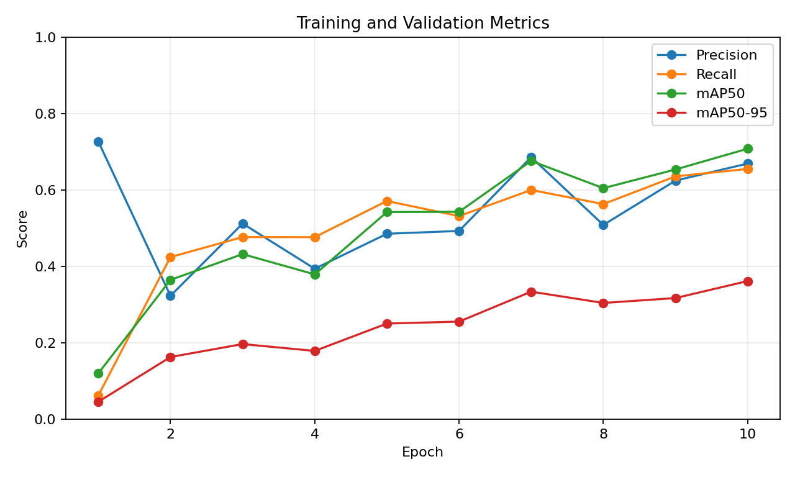
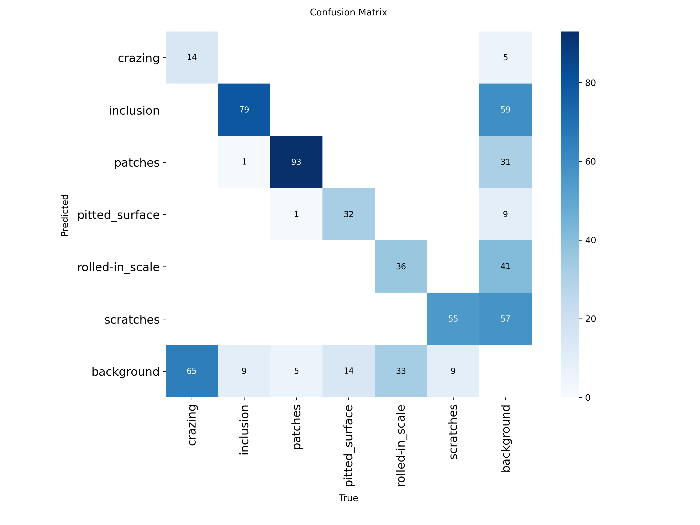
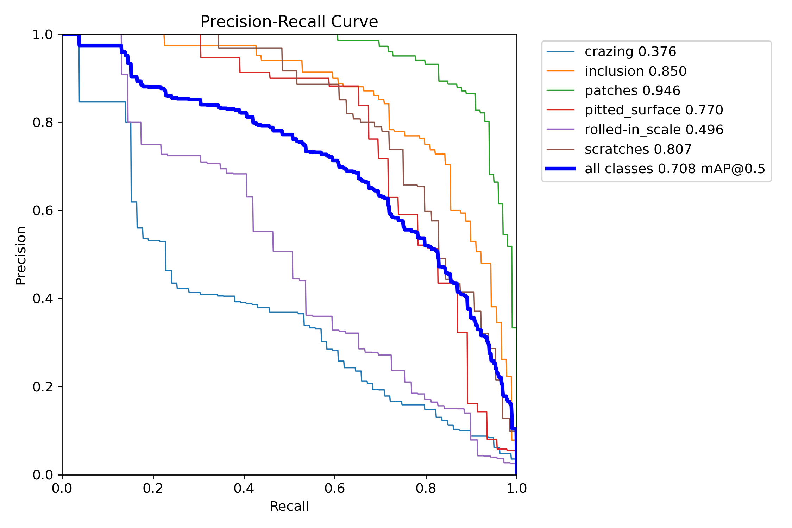
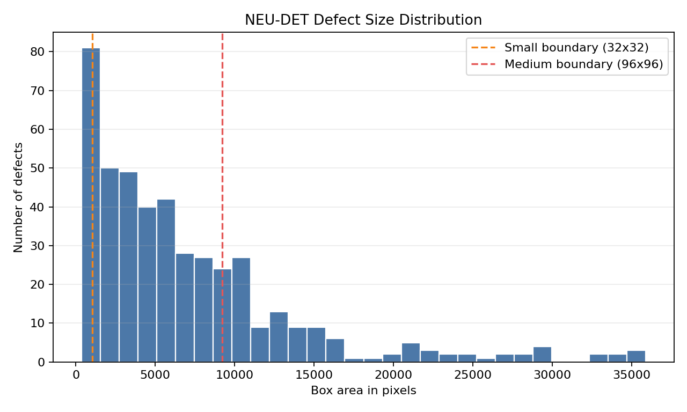

# Automotive Surface Defect Detection

[](https://github.com/Ylt00/automotive-surface-defect-detection/actions/workflows/ci.yml)


YOLOv8-based surface defect detection for automotive and industrial quality inspection. The project covers NEU-DET preparation, baseline training, evaluation, prediction, visual reporting, P2 comparison, and automated testing.

## Project Highlights

- Prepares the public six-class NEU-DET surface defect dataset
- Validates 1800 images and 4189 defect boxes
- Trains and evaluates a YOLOv8n baseline
- Generates defect grids, size analysis, confusion matrix, and PR curves
- Compares YOLOv8n against a P2 high-resolution detection-head experiment
- Documents the P2 negative result with controlled settings and limitations
- Provides an installable CLI and GitHub Actions CI

## Detection Results







## Evaluation Analysis











## Model Results

| Model | Precision | Recall | mAP50 | mAP50-95 | Params | GFLOPs |
|---|---:|---:|---:|---:|---:|---:|
| YOLOv8n 224px baseline | 0.668 | 0.655 | 0.708 | 0.361 | 3,006,818 | 8.1 |
| YOLOv8n 128px control | 0.344 | 0.487 | 0.387 | 0.172 | 3,006,818 | 8.1 |
| YOLOv8n-P2 128px | 0.628 | 0.312 | 0.284 | 0.102 | 2,921,832 | 12.2 |

The 224-pixel baseline is the primary project result. P2 underperformed in the low-cost CPU comparison and is retained as a documented negative result, not presented as an improvement.

## Quick Start

Install the package:

```powershell
python -m pip install -e ".[train]"
```

Clone the public data source and prepare the NEU-DET dataset:

```powershell
python -m defect_detection.cli clone-data --destination data/raw/neu-det-source
python -m defect_detection.cli prepare-data --source data/raw/neu-det-source --output data/processed/neu-det --report reports/neu-det-stats.json --force
python -m defect_detection.cli validate --data data/processed/neu-det/data.yaml
```

Train the baseline:

```powershell
python -m defect_detection.cli train --config configs/neu-det-cpu.yaml
```

Evaluate:

```powershell
python -m defect_detection.cli evaluate --weights runs/train/neu-det-yolov8n/weights/best.pt --data data/processed/neu-det/data.yaml --imgsz 224 --device cpu
```

Predict:

```powershell
python -m defect_detection.cli predict --weights runs/train/neu-det-yolov8n/weights/best.pt --source data/processed/neu-det/images/val --imgsz 224 --device cpu
```

Generate the visual report:

```powershell
python -m defect_detection.cli report --images data/processed/neu-det/images/val --labels data/processed/neu-det/labels/val --predictions runs/predict/neu-det-yolov8n --metrics runs/val/neu-det-yolov8n/metrics.json --results runs/train/neu-det-yolov8n/results.csv --plots runs/val/neu-det-yolov8n
```

## Dataset

| Item | Value |
|---|---:|
| Source | NEU-DET |
| Train images | 1620 |
| Validation images | 180 |
| Total images | 1800 |
| Defect boxes | 4189 |
| Classes | 6 |
| Validation errors | 0 |

Defect classes:

```text
crazing
inclusion
patches
pitted_surface
rolled-in_scale
scratches
```

Raw images and processed data are not committed. The source repository is cited in `docs/dataset.md`, and dataset licensing remains separate from the code's MIT license.

## Repository Structure

```text
automotive-surface-defect-detection/
├─ configs/                  # Baseline, P2, and fast comparison configs
├─ docs/
│  ├─ analysis/              # Metric charts and model comparison
│  ├─ assets/                # Detection result grids
│  ├─ experiments/           # Experiment records
│  ├─ dataset.md
│  └─ resume-summary.md
├─ reports/                  # Metrics and dataset statistics
├─ scripts/                  # Dataset preparation helper
├─ src/defect_detection/     # Python package and CLI
├─ tests/                    # Unit tests
└─ .github/workflows/ci.yml  # Python 3.10 and 3.12 CI
```

## Resume Highlights

- Built a six-class automotive surface defect detection pipeline covering data validation, YOLOv8n training, mAP evaluation, prediction, and visual reporting.
- Achieved Precision 0.668, Recall 0.655, mAP50 0.708, and mAP50-95 0.361 on the NEU-DET validation set.
- Generated ground-truth and prediction grids, defect-size analysis, training curves, confusion matrix, PR curve, and F1 curve.
- Added a P2 high-resolution detection-head experiment and documented its negative result using controlled settings.
- Added unit tests and GitHub Actions CI across Python 3.10 and 3.12.

## Limitations

- NEU-DET images are 200x200 and represent a research dataset rather than a production factory line.
- Class performance is uneven, especially for crazing and rolled-in scale.
- The P2 comparison uses a short 128-pixel CPU protocol because full-size P2 training is computationally expensive.
- The project is for engineering and research learning, not a deployed industrial inspection system.

## License

MIT